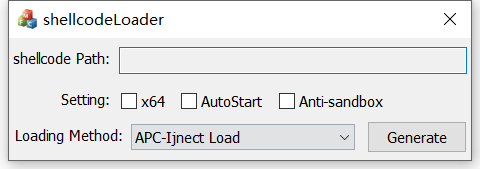
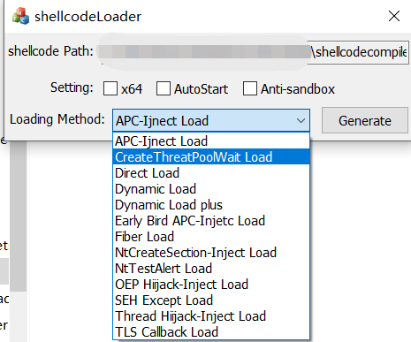
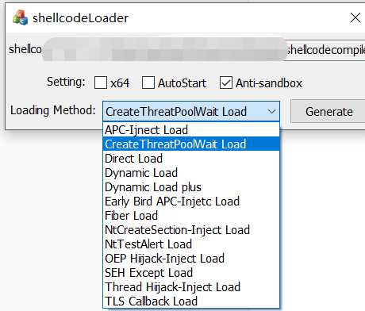
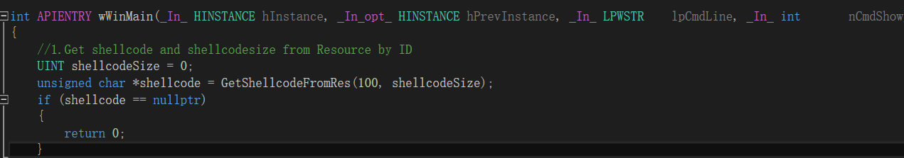
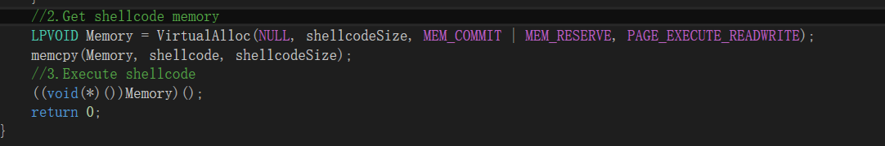
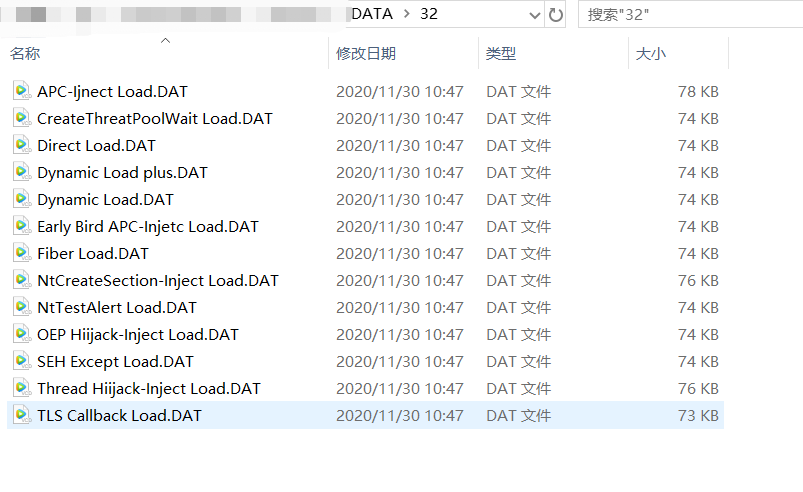

# ShellcodeLoader

语言： [中文](readme_cn.md) 

ShellcodeLoader of windows can bypass AV.

## Features

1. It has many loading modes. There are 13 loading modes in 32 bits and 12 loading modes in 64 bits.

2. Support development. If a new attack means is found, you can develop template according to the specified method.

3. Shellcode is automatically encrypted.The md5 of loaders that come from the same shellcode are different,because the generator uses time as seed to randomly generate 128-bit keys for encryption.

   

## To do list

Environment: The generator uses MFC to implement UI, the generator and loader templates are developed with C + +, and statically compiled by VS2015.

 Methods: Use vs2015 to open the project solution (. sln), and then compile.Of course,You can download the product from [realse](https://github.com/knownsec/shellcodeloader/releases/) .

## Files

  The tool is composed of a generator (Shellcodeloader.exe) and numerous loader templates. Different loader templates need to be placed in the corresponding arch of directories. And finally put into the DATA folder under the same directory of the generator.

## How to use

1. **Open the generator(shellcode.exe)**

   

   

2. **Drag your raw shellcode(.bin) into the generator**

   

   

3. **Choose the loader's arch (default x86)，And select the configuration options you want, whether you want to autostart(which comes with a registry), and whether you want to antisandbox(This option is not required for most 64-bit loaders)**

   

4. **Choose how you want to load it. Different loading methos depending on the loading template in the DATA floder.**

   

   

5. **Click Generate and the final loader will be generated on the desktop. **

   

## How to expand

1. include public.hpp in your cpp.

   

2. Call the GetShellcodeFromRes() function to get shellcode,the number 100 is immutable,unless you change the resourceID in generator.

   

   It will return the pointer of shellcode in resource，and shellcodesize is size of sehllcode.In most cases, this step doesn't need to be changed, you can do anything after you get the shellcode.

   

3. Loading shellcode in your method ,and compile(PS:**Make sure you compile statically and cancel the debug symbolic link**)

   

   

4. Use method name your template,this name will be loading method's name on UI,and change its format to "DAT",，Put it in correct arch in DATA folder ,The generator will automatically get the loading method.

   

   

###  About public.hpp

  public.hpp contains the necessary comments.If you want other ways of anti sandbox, you can change the content of anti sandbox function; if you want other ways of self starting, you can change the content of autostart function. In most cases, the contents of other function bodies do not need to be changed.

## Result

  Virus total detection results,based on Cobalt Strike original shellcode without anti-sandbox option as an example:

| Loading methods             | Detected |
| --------------------------- | -------- |
| CreateThreadpoolWait Load   | 3/72     |
| Fiber Load                  | 4/72     |
| NtTestAlert Load            | 5/70     |
| SEH Except Load             | 2/72     |
| TLS CallBack Load           | 28/71    |
| Dynamic Load                | 1/72     |
| Dynamic Load plus           | 28/71    |
| Syscall Load                | 1/69     |
| APC-Inject Load             | 6/72     |
| Early Brid APC-Inject Load  | 4/72     |
| NtCreateSection-Inject Load | 2/71     |
| OEP Hiijack-Inject Load     | 3/72     |
| Thread Hiijack-Inject Load  | 6/72     |

After clieck the anti-sandbox option in the dynamic loading mode, the results are as follows:

Bypass network interception of norton's smart firewall,and online by this tool.

## Ref

- [Antisandbox](https://0xpat.github.io/Malware_development_part_2/)
- [RC4 Crypt](https://www.52pojie.cn/thread-800115-1-1.html)
- [CreateThreadpoolWait Load](https://www.ired.team/offensive-security/code-injection-process-injection/shellcode-execution-via-createthreadpoolwait)
- [Fiber Load](https://www.ired.team/offensive-security/code-injection-process-injection/executing-shellcode-with-createfiber)
- [NtTestAlert Load](https://www.ired.team/offensive-security/code-injection-process-injection/shellcode-execution-in-a-local-process-with-queueuserapc-and-nttestalert)
- [SEH except Load](https://idiotc4t.com/code-and-dll-process-injection/seh-code-execute)
- [TLS callback Load](https://idiotc4t.com/code-and-dll-process-injection/tls-code-execute)
- [syscall Load](https://modexp.wordpress.com/2020/06/01/syscalls-disassembler/)
- [APC Inject Load](https://www.ired.team/offensive-security/code-injection-process-injection/apc-queue-code-injection)
- [Early Bird APC Inject Load](https://www.ired.team/offensive-security/code-injection-process-injection/early-bird-apc-queue-code-injection)
- [Early Brid APC Inject](https://www.ired.team/offensive-security/code-injection-process-injection/early-bird-apc-queue-code-injection)
- [NtCreateSection Inject Load](https://www.ired.team/offensive-security/code-injection-process-injection/ntcreatesection-+-ntmapviewofsection-code-injection)
- [OEP Hiijack Hiijack Inject Load](https://www.ired.team/offensive-security/code-injection-process-injection/addressofentrypoint-code-injection-without-virtualallocex-rwx)
- [Thread Hiijack Inject Load](https://idiotc4t.com/code-and-dll-process-injection/setcontext-hijack-thread)
- 《加密与解密4》
