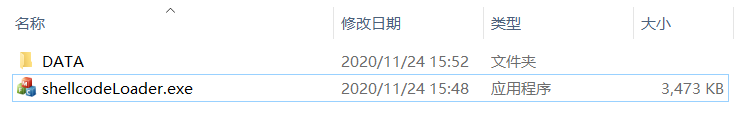
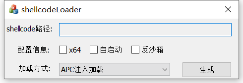
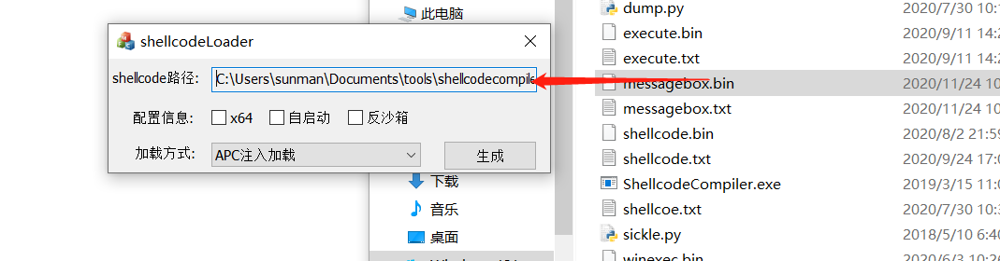
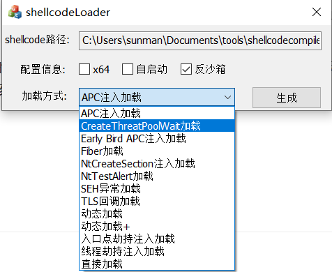
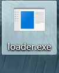
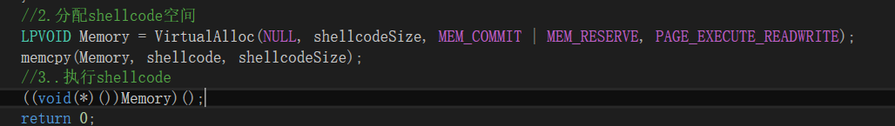
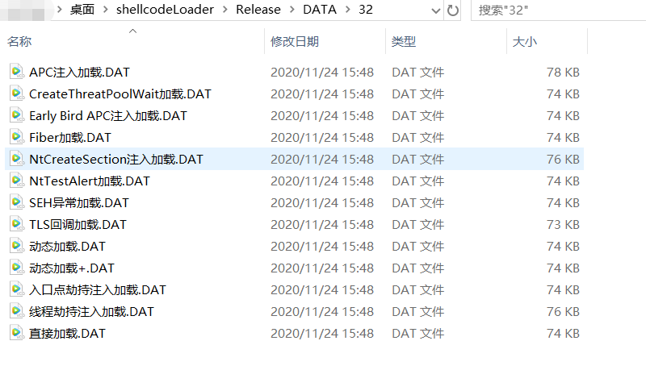
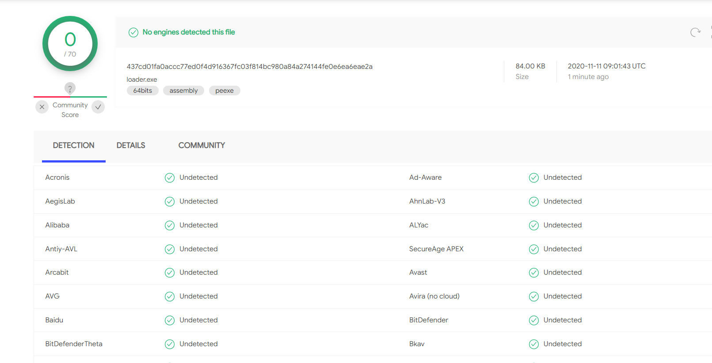
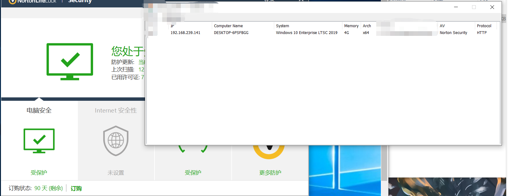

# ShellcodeLoader

Language： [English](Readme.md) 

Windows平台的shellcode免杀加载器。

## 功能特点

1. 自带多种加载方式。32位自带13种加载方式，64位自带12种加载方式。

2. 支持拓展。如果发现新的利用方式，按指定方式开发模板即可。

3. shellcode自动随机加密。使用时间为种子，生成128位密钥进行加密，相同shellcode出来的加载器的md5也不相同。

   

## 编译环境和方法

   环境:生成器使用MFC实现UI，生成器和加载器模板均使用C++开发，VS2015静态编译。

   方法:使用VS2015打开项目的解决方案(.sln)，再进行编译即可。你也可以从[realse](https://github.com/knownsec/shellcodeloader/releases/)下载成品。

## 文件组成

  本工具由生成器(shellcodeLoader.exe),和众多加载器模板组成。不同的加载器模板需放入对应位数的目录。并最终放入生成器同目录下的DATA目录。

## 使用方法

1. **打开生成器**

   

   

2. **将想要加载的shellcode源文件(.bin)拖入该窗口**

   

   

3. **勾选加载器的运行位数，并选择你需要的配置选项，是否需要自启动(自带方式皆为注册表方式自启动)，是否需要反沙箱(64位下多数杀软不需要该选项即可免杀)**

   

4. **选择你想要的加载方式，不同位数下的加载方式会有不同，其取决于DATA目录下对应的加载器模板。**

   

   

5. **点击生成，则会在桌面生成最终的加载器。**

   

## 拓展方法

1. 在你新的模板源文件前包含public.hpp.

   

2. 调用GetShellcodeFromRes()函数获取shellcode信息,注意100不可更改，除非你改了生成器中的资源序号。

   

   其返回shellcode的数据指针，并且，shellcodeSize就是shellcode的大小。多数情况下，这一步是不需要进行更改的，你可以在获取shellcode之后做任何事。

   

3. 按照你需要的方法加载shellcode，完成后进行编译(PS:请确保你进行了静态编译，且取消了调试符号链接).

   

   

4. 将编译出来的文件进行指定命名,这里的命名就是UI上最终现实的加载方式名称，并将其后缀改为DAT，放入指DATA目录下指定位数的目录中，生成器会自动获取该加载方式。

   

   

###  关于public.hpp

  public.hpp源码中含有必要的注释。如果你想要其他的方式进行反沙箱,你可以更改antisandbox中的函数；如果你想要其他方式自启动，你可以更改autostart函数中的内容。其他函数体的内容多数情况下是不需要更改的。

## 使用效果

VT检测效果，均以CS原始shellcode，并不勾选反沙箱为例：

| 加载方式                 | 未绕过率 |
| ------------------------ | -------- |
| CreateThreadpoolWait加载 | 3/72     |
| Fiber加载                | 4/72     |
| NtTestAlert加载          | 5/70     |
| SEH异常加载              | 2/72     |
| TLS回调加载              | 28/71    |
| 动态加载                 | 1/72     |
| 动态加载plus             | 28/71    |
| 系统call加载             | 1/69     |
| APC注入加载              | 6/72     |
| Early Brid APC注入加载   | 4/72     |
| NtCreateSection注入加载  | 2/71     |
| 入口点劫持注入加载       | 3/72     |
| 线程劫持注入加载         | 6/72     |

在动态加载方式勾选反沙箱之后，结果如下：

使用该加载器bypass诺顿的智能防火墙出网拦截，并上线:

## 参考

- [反沙箱](https://0xpat.github.io/Malware_development_part_2/)
- [RC4算法](https://www.52pojie.cn/thread-800115-1-1.html)
- [CreateThreadpoolWait加载](https://www.ired.team/offensive-security/code-injection-process-injection/shellcode-execution-via-createthreadpoolwait)
- [Fiber加载](https://www.ired.team/offensive-security/code-injection-process-injection/executing-shellcode-with-createfiber)
- [NtTestAlert加载](https://www.ired.team/offensive-security/code-injection-process-injection/shellcode-execution-in-a-local-process-with-queueuserapc-and-nttestalert)
- [SEH异常加载](https://idiotc4t.com/code-and-dll-process-injection/seh-code-execute)
- [TLS回调加载](https://idiotc4t.com/code-and-dll-process-injection/tls-code-execute)
- [系统call加载](https://modexp.wordpress.com/2020/06/01/syscalls-disassembler/)
- [APC注入](https://www.ired.team/offensive-security/code-injection-process-injection/apc-queue-code-injection)
- [Early Bird APC注入](https://www.ired.team/offensive-security/code-injection-process-injection/early-bird-apc-queue-code-injection)
- [Early Brid APC注入原理](https://www.ired.team/offensive-security/code-injection-process-injection/early-bird-apc-queue-code-injection)
- [NtCreateSection注入](https://www.ired.team/offensive-security/code-injection-process-injection/ntcreatesection-+-ntmapviewofsection-code-injection)
- [入口点劫持注入](https://www.ired.team/offensive-security/code-injection-process-injection/addressofentrypoint-code-injection-without-virtualallocex-rwx)
- [线程劫持注入](https://idiotc4t.com/code-and-dll-process-injection/setcontext-hijack-thread)
- 《加密与解密4》
